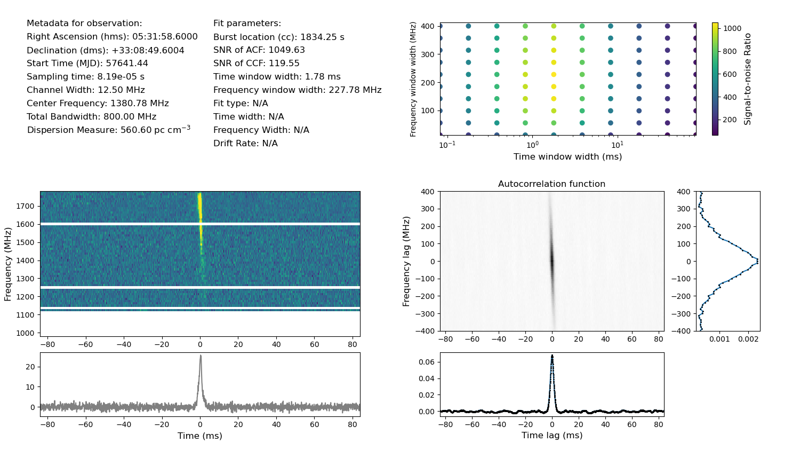

Pulse finder is a collection of python executables and scripts that searches for single pulses from fast radio bursts with a known dispersion measure. The main executable pulse_find.py works by taking an autocorrelation function of the intensity data located in a PSRFITS or filterbank file, and comparing that autocorrelation function to what would be expected from noise to detect candidates.

Written using python 3.7.6, although any version of python3 should probably work.

Dependencies:
	numpy
	scipy
	astropy
	matplotlib
	tqdm
All of these dependencies come installed with conda, so if one doesn't want to install them one-by-one, a simple solution is to install conda.
	
	

A minimal usage would be something like the following:
	
	python pulse_find.py --infile <fits or fil file> --d <dm> --cross_corr 1 <outfilename>

The above command will take in the given fits or filterbank file containing the data of interest, dedisperse using DM=dm, and generate candidates by breaking the data into time and frequency chunks, and taking the autocorrelation function of each chunk. These will then be cross-correlated (from the --cross_corr 1 call) with the best fit boxcar to the autocorrelation function. The final candidates will be saved a pickled .npy file, with the name
	
	<outfilename>_<time_of_burst>s_burst.npy

where time_of_burst is the location of the burst in seconds from the beginning of the observation. A list containing all of the burst candidate objects is also pickled and saved as,

	<outfilename>_bursts.npy
	
and a text file containing the burst location in seconds, the topocentric arrival time in MJD, the maximum SNR of the ACF, the DM, and the time and frequency widths of the best fit boxcar to the ACF in comma delimited format will be saved as

	<outfilename>_detected_bursts.txt

Note that there are some intricacies in the listed arrival times in seconds and in MJD. If the user does not use the interactive GUI to select bursts, or does not choose to cross correlate, then the arrival time will correspond to the start time of the frequency and time chunk that the burst is in. This is because the ACF by itself does not provide information about where a burst is located in frequency and time in a chunk of data. 

To generate a diagnostic plot from the pickled data, the following command can be used,
	
	python acf_plot.py <outfilename>_<time_of_burst>s_burst.npy.

which will generate a plot which looks like the following,

Format: 

